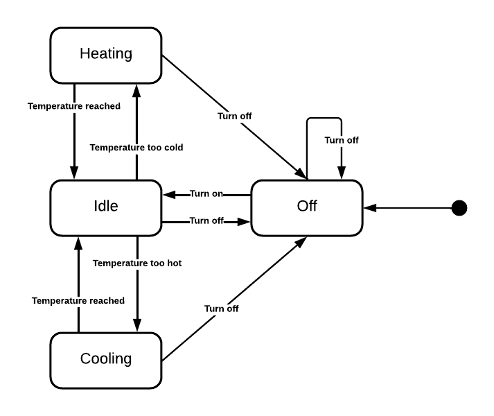
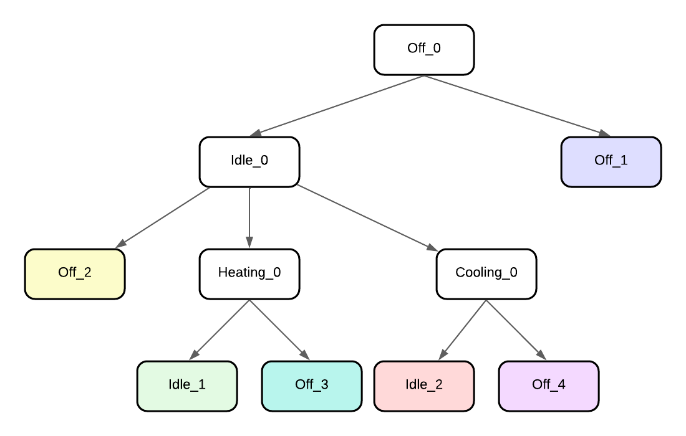

# Week 3: Model-based testing

## 1. State Machine

There are:
- 4 states:
    - Off (initial state)
    - Idle
    - Heating
    - Cooling
- 5 events:
    - turn on
    - turn off
    - temperature reached
    - temperature too hot
    - temperature too cold
- 9 transitions

## 2. Transition Tree

There are 6 different paths (colored).

## 3. Transition Table

| State \ Event | turn on | turn off | temperature reached | temperature too hot | temperature too cold |
|---------------|---------|----------|---------------------|---------------------|----------------------|
| Off           | Idle    | Off      | -                   | -                   | -                    |
| Idle          | -       | Off      | -                   | Cooling             | Heating              |
| Heating       | -       | Off      | Idle                | -                   | -                    |
| Cooling       | -       | Off      | Idle                | -                   | -                    |

There are 11 sneaky paths. For example, Off -> Heating or Off -> Cooling.