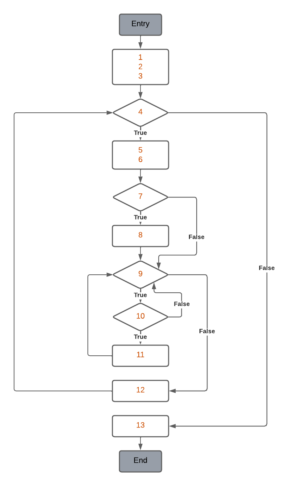

# Structural testing - Week 4

## 1. Line coverage exercise

The `Player` class from the `nl.tudelft.jpacman.level` package that has 93% line coverage. The missing covered line is on the method `setAlive()`, which is `deathSprite.setAnimating(false);`. Note that there were more lines that were not covered in the original version of the code. However, in week 2 I was able to inadvertently cover them by testing the `Player` class.

### Source 

```java
public void setAlive(boolean isAlive) {
    if (isAlive) {
        deathSprite.setAnimating(false);
    }
    if (!isAlive) {
        deathSprite.restart();
    }
    this.alive = isAlive;
}
```

### Test

To cover the missing line, I created a test that calls the method, setting it alive, and then check if the `deathSprite` was not animating. The test is on the file `PlayerTest.java`.

```java
@Test
void testAlive() {
    // Set alive
    player.setAlive(true);
    assertThat(player.isAlive()).isTrue();
}
```

## 2. Branch coverage exercise

The `BoardPanel` class from the `nl.tudelft.jpacman.ui` package has 2 missing branches to be completely covered. The missing branches are on the constructor and on `paint()`, where an assert needs to be tested for both.

### Source 

```java
BoardPanel(Game game) {
    super();
    assert game != null;
    this.game = game;
    ...
```

```java
public void paint(Graphics g) {
    assert g != null;
    render(game.getLevel().getBoard(), g, getSize());
}
```

### Tests

To cover the mentioned branches, the following tests were created on the file `BoardPanelTest.java`.

```java
@Test // test null game on constructor
void testNullGame() {
    try {
        BoardPanel boardPanel = new BoardPanel(null);
    } catch (AssertionError e) {
        assertThat(e).isInstanceOf(AssertionError.class);
    }
}

@Test // test pain method will null graphics
void testPaintNullGraphics() {
    try {
        boardPanel.paint(null);
    } catch (AssertionError e) {
        assertThat(e).isInstanceOf(AssertionError.class);
    }
}
```

## 3. Cyclomatic Complexity exercise

### Code

```java
      private List<Class<? extends Unit>> getInheritance(Class<? extends Unit> clazz) {
 1        List<Class<? extends Unit>> found = new ArrayList<>();
 2        found.add(clazz);

 3        int index = 0;
 4        while (found.size() > index) {
 5            Class<?> current = found.get(index);
 6            Class<?> superClass = current.getSuperclass();
 7            if (superClass != null && Unit.class.isAssignableFrom(superClass)) {
 8                found.add((Class<? extends Unit>) superClass);
            }
 9            for (Class<?> classInterface : current.getInterfaces()) {
10                if (Unit.class.isAssignableFrom(classInterface)) {
11                    found.add((Class<? extends Unit>) classInterface);
                }
            }
12            index++;
        }

13        return found;
      }
```

### Diagram



### Cyclomatic Complexity

As this is a structured function, i.e. with a single exit point, the CC cam be computed as `N_Edges - N_Nodes + 2P`, which is `13 - 10 + 2*1 = 5`.

### Independent Paths

Considering the cyclomatic complexity of 5, we need to find 5 independent paths. The paths are the following:

- Path 1: 1, 2, 3, 4, 13
- Path 2: 1, 2, 3, 4, 5, 6, 7, 9, 12, 4, 13
- Path 3: 1, 2, 3, 4, 5, 6, 7, 8, 9, 10, 11, 9, 12, 4, 13
- Path 4: 1, 2, 3, 4, 5, 6, 7, 9, 10, 9, 12, 4, 13
- Path 5: 1, 2, 3, 4, 5, 6, 7, 9, 12, 4, 13

### Test Cases

- Path 1: It is impossible to test this path, as a member is always added to the list, and the loop will always be executed at least once.
- Path 2: For this test, we need a class that skips the condition that adds an element to the list, leading to the exit of the while loop. I used `Unit`, as it has no superclass.
- Path 3 and 4: This path involves the execution of both the `if` and the `for` statements. However, the for loop can not be entered as there are no classes that extend `Unit` and implement an interface. So, it is not possible to test paths that execute 10 and 11.
- Path 5: For this test, we need a class in which the first if condition returns true, and the second one returns false, leaving the loop after that. So, we need a class that directly derives from `Unit`. For example, I used `Player`.

The tests are implemented in `CollisionInteractionMapTest.java`.
