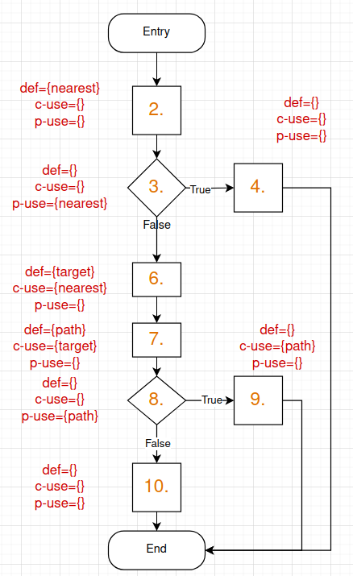
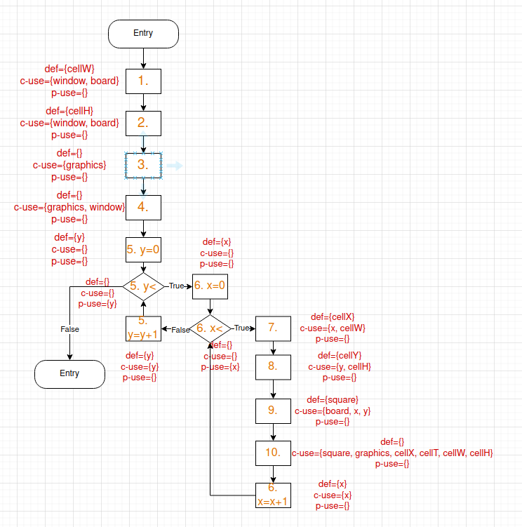

# Dataflow - Week 7

## 1. Perform ‘Dataflow Testing’

### 1.1. nextAiMove function in the nl.tudelft.jpacman.npc.ghost.Blinky class
 
```java
public Optional<Direction> nextAiMove() {
1    assert hasSquare();
2    Unit nearest = Navigation.findNearest(Player.class, getSquare());
3    if (nearest == null) {
4        return Optional.empty();
    }
5    assert nearest.hasSquare();
6    Square target = nearest.getSquare();

7    List<Direction> path = Navigation.shortestPath(getSquare(), target, this);
8    if (path != null && !path.isEmpty()) {
9        return Optional.ofNullable(path.get(0));
    }
10    return Optional.empty();
}
```



#### Def-use pairs:

Variable: nearest
id | def | use | path
--- | --- | --- | ---
1 | 2 | (3,T) | 2,3,4
2 | 2 | (3,F) | 2,3,6
3 | 2 | 6 | 2,3,6

Variable: target
id | def | use | path
--- | --- | --- | ---
1 | 6 | 7 | 6,7

Variable: path
id | def | use | path
--- | --- | --- | ---
1 | 7 | (8,T) | 7,8,9
2 | 7 | (8,F) | 7,8,10
3 | 7 | 9 | 7,8,9

#### All-Defs:
**All-defs** coverage is achieved as there is at least one def-clear path from every definition of each variable to at least one c-use or p-use of each variable.
To satisfy the **all-defs** criteria, we must test, for example, the paths in the following pairs:
|variable|nearest|target|path|
|---|---|---|---|
|pair-id|3|1|3|

#### All-c-uses:
**All-c-uses** coverage is achieved when, for every program variable, at least one **def-clear path** from every definition of that variable to every **c-use** of it must be covered.
To satisfy the **all-c-uses** criteria, we must test, for example, the paths in the following pairs:
|variable|nearest|target|path|
|---|---|---|---|
|pair-id|3|1|3|

#### All-p-uses:
**All-p-uses** coverage is achieved when, for every program variable, at least one **def-clear path** from every definition of that variable to every **p-use** of it must be covered.
To satisfy the **all-p-uses** criteria, we must test, for example, the paths in the following pairs:
|variable|nearest|target|path|
|---|---|---|---|
|pair-id|1,2|-|1,2|

#### All-uses:
**All-uses** coverage is achieved when, for every program variable, at least one **def-clear path** from every definition of that variable to every **c-use** and every **p-use** (including all outgoing edges of the predicate statement) of it must be covered.
Requires that all def-use pairs are covered.
To satisfy the **all-uses** criteria, we must test, for example, the paths in the following pairs:
|variable|nearest|target|path|
|---|---|---|---|
|pair-id|1,2,3|1|1,2,3|

#### Tests
Basically, we need to test the following scenarios:
- nearest is null
- nearest is not null
- target is null
- target is not null
The tests are implemented in `ClydeTest.java`.

### 1.2. render function in the nl.tudelft.jpacman.ui.BoardPanel class
```java
private void render(Board board, Graphics graphics, Dimension window) {
1    int cellW = window.width / board.getWidth();
2    int cellH = window.height / board.getHeight();

3    graphics.setColor(BACKGROUND_COLOR);
4    graphics.fillRect(0, 0, window.width, window.height);

5    for (int y = 0; y < board.getHeight(); y++) {
6        for (int x = 0; x < board.getWidth(); x++) {
7            int cellX = x * cellW;
8            int cellY = y * cellH;
9            Square square = board.squareAt(x, y);
10            render(square, graphics, cellX, cellY, cellW, cellH);
        }
    }
}
```



#### Def-use pairs:
**cellW**
| pair id | def | use | path                                          |
| ------- | --- | --- | --------------------------------------------- |
| 1       | 1   | 7   | 1, 2, 3, 4, 5.1, 5.2, 6.1, 6.2, 7           |
| 2       | 1   | 10  | 1, 2, 3, 4, 5.1, 5.2, 6.1, 6.2, 7, 8, 9, 10 |

**cellH**
| pair id | def | use | path                                       |
| ------- | --- | --- | ------------------------------------------ |
| 1       | 2   | 8   | 2, 3, 4, 5.1, 5.2, 6.1, 6.2, 7, 8        |
| 2       | 2   | 10  | 2, 3, 4, 5.1, 5.2, 6.1, 6.2, 7, 8, 9, 10 |

**y**
| pair id | def | use      | path                          |
| ------- | --- | -------- | ----------------------------- |
| 1       | 5.1 | (5.2, T) | 5.1, 5.2, 6.1               |
| 2       | 5.1 | (5.2, F) | 5.1, 5.2, 6.1               |
| 3       | 5.3 | (5.2, T) | 5.3, 5.2, 6.1               |
| 4       | 5.3 | (5.2, F) | 5.3, 5.2, end               |
| 5       | 5.1 | 5.3      | 5.1, 5.2, 6.1, 6.2, 5.3     |
| 6       | 5.3 | 5.3      | 5.3, 5.2, 6.1, 6.2, 5.3     |
| 7       | 5.1 | 8        | 5.1, 5.2, 6.1, 6.2, 7, 8    |
| 8       | 5.3 | 8        | 5.3, 5.2, 6.1, 6.2, 7, 8    |
| 9       | 5.1 | 9        | 5.1, 5.2, 6.1, 6.2, 7, 8, 9 |
| 10      | 5.3 | 9        | 5.3, 5.2, 6.1, 6.2, 7, 8, 9 |

**x**
| pair id | def | use      | path                         |
| ------- | --- | -------- | ---------------------------- |
| 1       | 6.1 | (6.2, T) | 6.1, 6.2, 7                |
| 2       | 6.1 | (6.2, F) | 6.1, 6.2, 5.3              |
| 3       | 6.3 | (6.2, T) | 6.3, 6.2, 7                |
| 4       | 6.3 | (6.2, F) | 6.3, 6.2, 5.3              |
| 5       | 6.1 | 6.3      | 6.1, 6.2, 7, 8, 9, 10, 6.3 |
| 6       | 6.3 | 6.3      | 6.3, 6.2, 7, 8, 9, 10, 6.3 |
| 7       | 6.1 | 7        | 6.1, 6.2, 7                |
| 8       | 6.3 | 7        | 6.3, 6.2, 7                |
| 9       | 6.1 | 9        | 6.1, 6.2, 7, 8, 9          |
| 10      | 6.3 | 9        | 6.3, 6.2, 7, 8, 9          |

**cellX**
| pair id | def | use | path          |
| ------- | --- | --- | ------------- |
| 1       | 7   | 10  | 7, 8, 9, 10 |

**cellY**
| pair id | def | use | path       |
| ------- | --- | --- | ---------- |
| 1       | 8   | 10  | 8, 9, 10 |

**square**
| pair id | def | use | path    |
| ------- | --- | --- | ------- |
| 1       | 9   | 10  | 9, 10 |

#### All-Defs:
**All-defs** coverage is achieved as there is at least one def-clear path from every definition of each variable to at least one c-use or p-use of each variable.
To satisfy the **all-defs** criteria, we must test, for example, the paths in the following pairs:
| variable | cellW | cellH | y    | x    | cellX | cellY | square |
| -------- | ----- | ----- | ---- | ---- | ----- | ----- | ------ |
| pair-id  | 1     | 1     | 1, 8 | 1, 8 | 1     | 1     | 1      |

#### All-c-uses:
**All-c-uses** coverage is achieved when, for every program variable, at least one **def-clear path** from every definition of that variable to every **c-use** of it must be covered.
To satisfy the **all-c-uses** criteria, we must test, for example, the paths in the following pairs:
| variable | cellW | cellH | y                 | x                 | cellX | cellY | square |
| -------- | ----- | ----- | ----------------- | ----------------- | ----- | ----- | ------ |
| pair-id  | 1, 2  | 1, 2  | 5, 6, 7, 8, 9, 10 | 5, 6, 7, 8, 9, 10 | 1     | 1     | 1      |

#### All-p-uses:
**All-p-uses** coverage is achieved when, for every program variable, at least one **def-clear path** from every definition of that variable to every **p-use** of it must be covered.
To satisfy the **all-p-uses** criteria, we must test, for example, the paths in the following pairs:
| variable | cellW | cellH | y          | x          | cellX | cellY | square |
| -------- | ----- | ----- | ---------- | ---------- | ----- | ----- | ------ |
| pair-id  | NA    | NA    | 1, 2, 3, 4 | 1, 2, 3, 4 | NA    | NA    | NA     |

#### All-uses:
**All-uses** coverage is achieved when, for every program variable, at least one **def-clear path** from every definition of that variable to every **c-use** and every **p-use** (including all outgoing edges of the predicate statement) of it must be covered.
Requires that all def-use pairs are covered.
To satisfy the **all-uses** criteria, we must test, for example, the paths in the following pairs:
| variable | cellW | cellH | y                             | x                             | cellX | cellY | square |
| -------- | ----- | ----- | ----------------------------- | ----------------------------- | ----- | ----- | ------ |
| pair-id  | 1, 2  | 1, 2  | 1, 2, 3, 4, 5, 6, 7, 8, 9, 10 | 1, 2, 3, 4, 5, 6, 7, 8, 9, 10 | 1     | 1     | 1      |

#### Tests
Basically, we need to test the following scenarios: